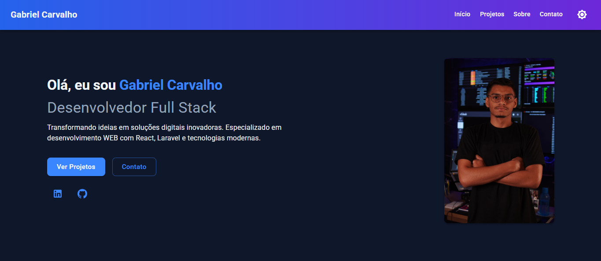

<h1 align="center">
    <a href="https://laravelcollective.com/tools/banner">
        
    </a>
</h1>

# 📝 Devfolio | Gabriel Carvalho

<p align="center"> Devfolio desenvolvido para apresentar meus projetos e minhas habilidades como desenvolvedor. </p>

<h2 align="center">
  
  
  
</h2>

## 📌 Índice
<p align="center">         
  <a href="#tecnologias">Tecnologias </a> &nbsp; &nbsp; &nbsp; | &nbsp; &nbsp; &nbsp;        
  <a href="#instalação"> Instalação e Uso </a> &nbsp; &nbsp; &nbsp;
</p>          

## Tecnologias                                


## ⚙ Instalação   

### Rodar projeto localmente

Primeiro, clone o repositório para seu ambiente:

```bash
> git clone https://github.com/Gabrielrc11/devfolio.git
```

Entre na pasta do projeto:

```bash
> cd devfolio
```

Instale as dependencias do projeto:

```bash
> npm install
```

Por ultimo, rode o projeto localmente:

```bash
> npm run dev
```

-------------          

- [Voltar ao Início](#index)